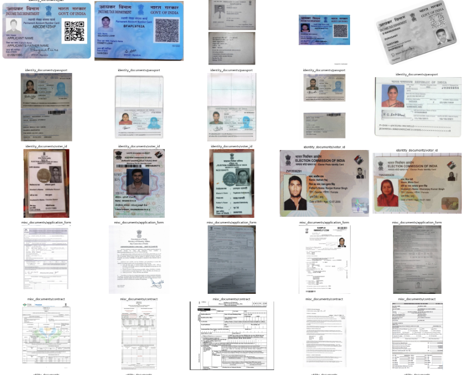
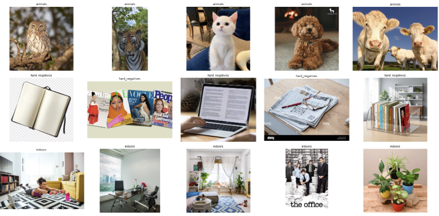
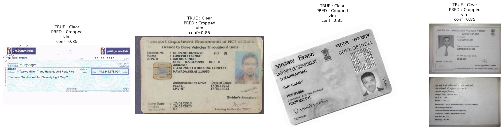
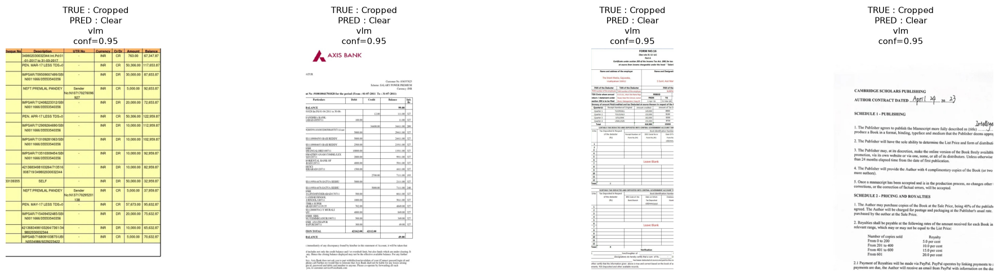
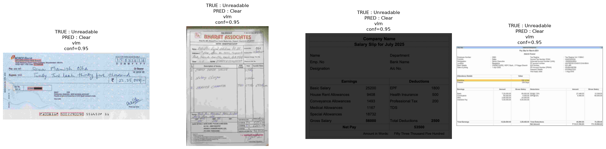
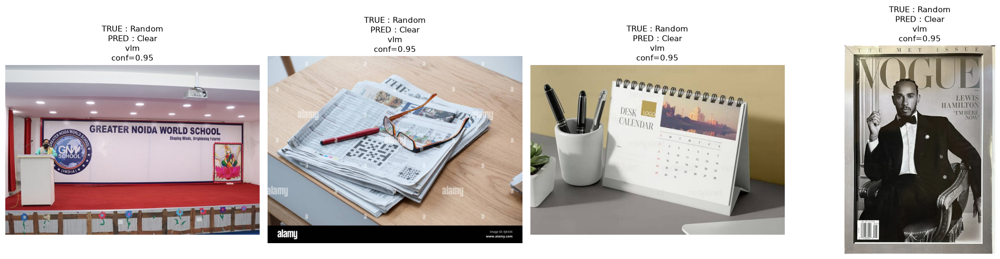

# Document Gateway
### Hybrid Computer Vision + Vision Language Model Pipeline for Document Pre-validation

Lightweight OpenCV routing combined with a Vision Language Model (Qwen2.5-VL via Ollama) to determine whether uploaded images are safe to send to OCR.

Design Principles Followed:

• Prioritise lightweight CV inference whenever confidence is sufficient.
• Escalate only ambiguous cases to the Vision Language Model.
• Treat unsafe OCR acceptance as a higher-cost error than conservative routing.
• Produce deterministic operational actions rather than raw class predictions.

---

## Table of Contents

- [Deliverables](#deliverables)
- [Repository Structure](#repository-structure)
- [Pipeline Architecture](#pipeline-architecture)
- [Installation](#installation)
- [Running the Pipeline](#running-the-pipeline)
- [Dataset Construction](#dataset-construction)
- [Evaluation](#evaluation)
    - [Dataset Statistics](#dataset-statistics)
    - [End-to-End Pipeline](#end-to-end-pipeline)
- [Failure Analysis](#failure-analysis)
- [Key Takeaways](#key-takeaways)
- [Future Improvements](#future-improvements)

---

# Deliverables

This repository contains:

| File | Description |
|------|-------------|
| `README.md` | Project documentation |
| **`final_validation_log.md`** | **All metric logged as per rubric**|
| `src/document_gateway.py` | Complete inference pipeline as script |
| `eval/` | Evaluation dataset |
| `artifacts/` | Evaluation outputs |
| `notebooks/` | To review experimental flow |

---

# Repository Key Structure

```text
document_gateway/
│
├── src/
│   ├── document_gateway.py 
│   ├── cv_features.py
│   └── gateway_config.py
│
├── notebooks/
│
├── eval/
|   ├── dataset
|   ├── manifest.json
│
├── final_validation_log.md
└── README.md
```

---

# Pipeline Architecture

```text
                        Input Image
                             │
                             ▼
                OpenCV Feature Extraction
      ┌───────────────────────────────────────┐
      │ document_score                        │
      │ crop_score                            │
      │ quality_score                         │
      └───────────────────────────────────────┘
                             │
                             ▼
                  Threshold-based CV Router
                             │
          ┌──────────────────┴───────────────────┐
          │                                      │
          ▼                                      ▼
 Direct confident decision              Ambiguous image
(Class 1 / 2 / 3 / 4)                 → Vision Language Model
                                              │
                                              ▼
                              Structured JSON prediction
                                              │
                                              ▼
                                 Final gaurdrailed routing decision 

                                            PASS
                                            FLAG
                                            DENOISE
                                            BLOCK
                                            MANUAL REVIEW
                    ```
---

# Installation

```bash
git clone ...

cd document_gateway

pip install -r requirements.txt
```

---

The lightweight CV layer estimates three independent properties of the uploaded image before any Vision Language Model inference.

| Score | Purpose | Representative Features |
|--------|---------|-------------------------|
| Document Score | Estimates whether the image primarily contains a document | Whitespace ratio, colour saturation, foreground/background separation |
| Crop Score | Estimates whether document content extends beyond the image boundary | Connected components touching borders, boundary ink density, projection discontinuities |
| Quality Score | Estimates OCR readability | Local sharpness, gradient energy, frequency response, dynamic range, exposure statistics |

These feature groups are combined into three normalized composite scores. Thresholds learned on the tuning dataset determine whether an image can be confidently routed by the CV layer or should be escalated to the Vision Language Model.

# Running the Pipeline

Example:

```bash
python src/document_gateway.py \
    eval/dataset/class2_cropped/identity_documents/aadhar/2__crop_top_left_medium_20pct.jpg \
    --config notebooks/config/final_locked_pipeline_config.json
```

Example output

```text
{
  "image_path": "eval/dataset/class2_cropped/identity_documents/aadhar/2__crop_top_left_medium_20pct.jpg",
  "cv": {
    "cv_prediction": null,
    "cv_route": "vlm_fallback",
    "requires_vlm": true,
    "document_score": 0.3196197782146397,
    "crop_score": 0.8548781414043879,
    "quality_risk": 0.5533783358973414,
    "quality_score": 0.4466216641026586
  },
  "vlm": {
    "success": true,
    "prediction": {
      "class_prediction": 2,
      "confidence_score": 0.85,
      "document_present": true,
      "meaningful_content_cropped": false,
      "materially_unreadable": false,
      "indeterminate": false,
      "justification": "The document is partially cropped, with the top and bottom edges visible but not the entire layout. The text appears to be readable, but part of it is missing beyond the image frame."
    }
  },
  "final": {
    "class_id": 2,
    "class_name": "Content Got Cut",
    "routing_action": "FLAG",
    "decision_source": "vlm",
    "safety_gate_reason": null
  }
}
```

---

# Dataset Construction

The validation dataset was manually curated to simulate real-world OCR inputs.

The dataset contains four routing classes:

| Class | Description |
|--------|-------------|
| Class 1 | Clear document suitable for OCR |
| Class 2 | Document content cropped |
| Class 3 | Document unreadable due to quality |
| Class 4 | Non-document images |

### Class 1 Images were collected across these categories:

- Aadhaar
- PAN
- Passport
- Salary slips
- Bank statements
- Receipts
- Invoices
- Utility bills
- Cheques



### Class 4 Images were collected across these categories:

- Animals
- Indoor Scenes, with/without people
- Outdoor Scenes, with/without macjines
- Hard Negatives, (random images with text and white background)



### Class 2 and 3 were collected by degarding Class 1 images using:

- Gaussian blur
- Motion blur
- JPEG compression
- Noise
- Low contrast
- Darkening
- Partial crops


---

# Evaluation

## Dataset Statistics

| split | Clear and Readable | Content Got Cut | Unclear / Unreadable | Random Image | Total |
| :--- | :---: | :---: | :---: | :---: | :---: |
| **evaluation** | 76 | 76 | 76 | 22 | **250** |
| **tuning** | 51 | 51 | 51 | 14 | **167** |
| **All data** | **127** | **127** | **127** | **36** | **417** |

### Evaluation Routing Summary

| Stage | Images | Percentage |
|--------|-------:|-----------:|
| Total evaluation images | 250 | 100.0% |
| Resolved by CV layer | 121 | 48.4% |
| Escalated to Qwen2.5-VL | 129 | 51.6% |
| Final PASS decisions | 113 | 45.2% |
| Non-PASS decisions | 137 | 54.8% |

---


---

## End-to-End Pipeline


| True class | PASS | FLAG | DENOISE | BLOCK | MANUAL_REVIEW | Support |
| :--- | :---: | :---: | :---: | :---: | :---: | :---: |
| **Clear and Readable** | 51 (67.1%) | 15 (19.7%) | 8 (10.5%) | 1 (1.3%) | 1 (1.3%) | **76** |
| **Content Got Cut** | 26 (34.2%) | 29 (38.2%) | 21 (27.6%) | 0 (0.0%) | 0 (0.0%) | **76** |
| **Unclear / Unreadable** | 30 (39.5%) | 12 (15.8%) | 33 (43.4%) | 1 (1.3%) | 0 (0.0%) | **76** |
| **Random Image** | 6 (27.3%) | 1 (4.5%) | 2 (9.1%) | 11 (50.0%) | 2 (9.1%) | **22** |


---

# Failure Analysis Per Class


### Class 1

Examples primarily confused with class 2: when ambiguous/unclear borders were assumed to be cropping



### Class 2

Examples primarily confused with class 1: where partial cropping was still considered readable.



---

### Class 3

Examples primarily confused with class 1: because of weak JPEG compression artefacts remained sufficiently readable for OCR (data augmentation strategies should have been stronger to ensure complete lack of readability).



---

### Class 4

Examples primarily confused with class 1: failures involved visually document-like objects (included specifically as hard-negatives) such as.

- magazines
- newspapers
- whiteboards
- printed calendars

These remain challenging because they contain structured layouts similar to documents.



---


# Key Takeaways

- Class 4 safety requirement was not met
  - 6/22 non-document images (27%) bypassed the filter to PASS, against a spec requirement of exactly 0. 
  - Failures were concentrated in a specific pattern: hard negatives with document-like structure (magazines, whiteboards, printed calendars) rather than random natural images. 

- Classes 2 and 3 traded raw classification recall for routing safety by design. 
  - Recall alone was moderate (Class 2: 38.2%, Class 3: 43.4%), but the routing-level "kept out of PASS" rate was higher (65.8% / 60.5%), since misroutes within the non-PASS paths (e.g., FLAG instead of DENOISE) still avoided unsafe OCR submission.

- A meaningful share of Class 3 errors trace back to dataset construction rather than model weakness:
  -  some synthetic degradations were not applied strongly enough to push borderline images past the unreadability threshold, so the model calling them "readable" was arguably a defensible read of the actual image.
.

# Future Improvements

1. Fix the dataset by increasing size and strengthening degradation (cheapest, addresses a diagnosed root cause):
2. Add more Class 4 hard negatives specifically in the failure pattern identified (text-bearing, page-like non-documents) rather than generic non-document volume.
3. Add explicit negative examples to the VLM prompt naming the actual hard-negative pattern found (magazines, whiteboards, printed calendars), rather than the current generic "landscape/object/environment" framing.
4. Try a two-step prompt: first detect readable text/structure, then separately judge whether that structure constitutes a self-contained document — the current single-pass prompt may be using "has text" as a proxy for "is a document," which hard negatives also satisfy.
5. Train a small binary document/non-document classifier on the document-vs-hard-negative pairs already identified, used as a gate before or alongside the VLM for Class 4 decisions.
6. Tune the existing CV histogram/bimodality signal specifically against the hard-negative set, since it wasn't built with text-on-non-document-surfaces in mind.
7. Larger VLM (highest cost, least targeted):
8. Confidence calibration for the VLM, since the Class 4 bypasses show high stated confidence didn't correlate with correctness. ( would help me with gaurdrail later at the end as well )